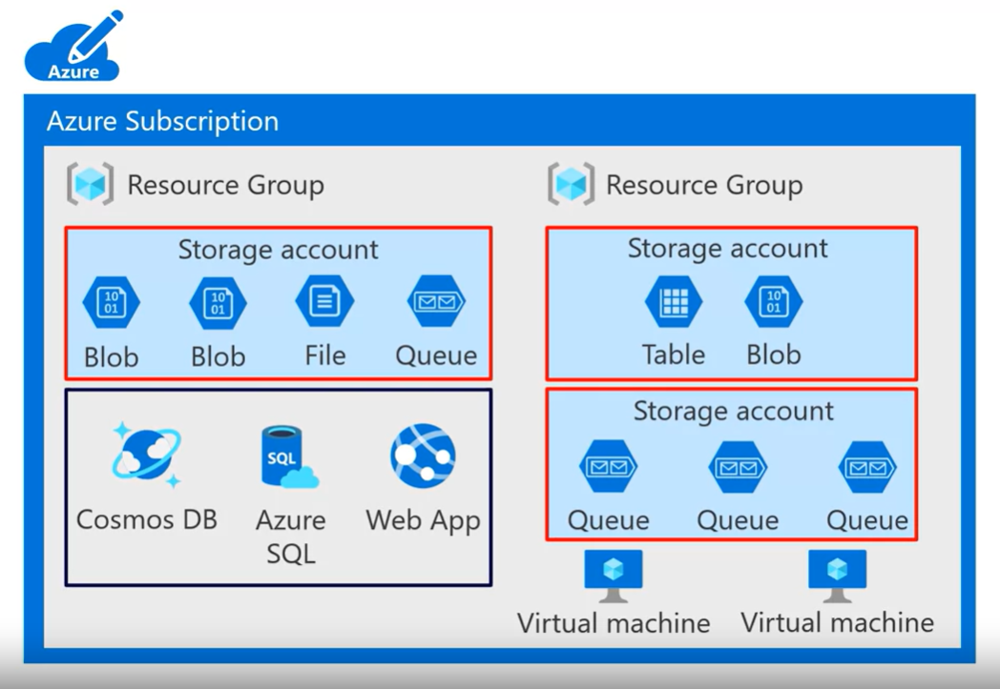
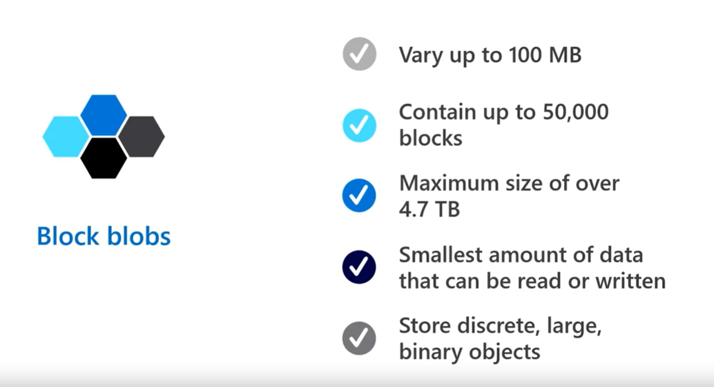
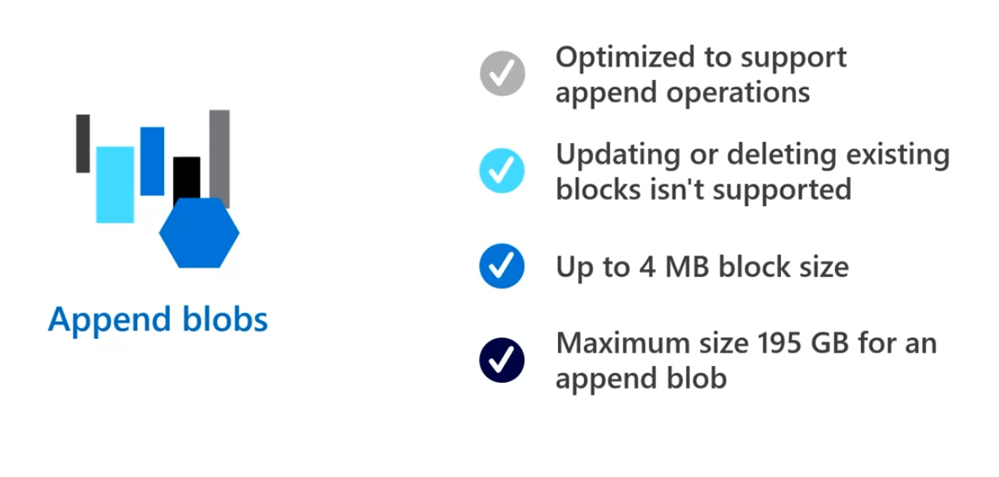
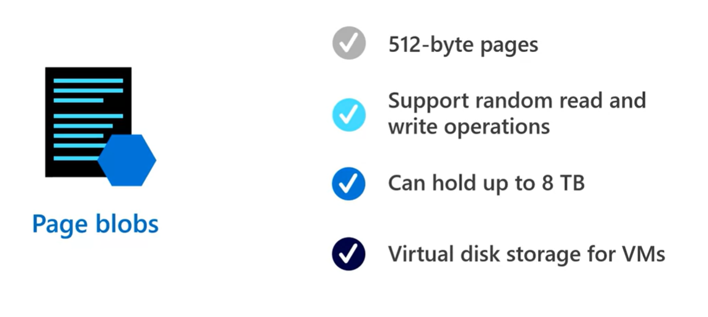

# 2. Data Storage in Microsoft Azure

Azure storage account holds `azure blob, files, queue, and table` storages as shown in the picture below under the `resource group`.
All the other data services like `cosmosdb, azure sql and web app` are also created under the `resource group` but not in the `storage account`.

Storage account defines a `policy` that applies all the services in the storage account.

Python App for Storage Account

[Go](https://learn.microsoft.com/en-us/azure/storage/blobs/storage-blob-python-get-started?tabs=azure-ad) to the documentation of the Azure SDK with python.

`BLOBS:`

