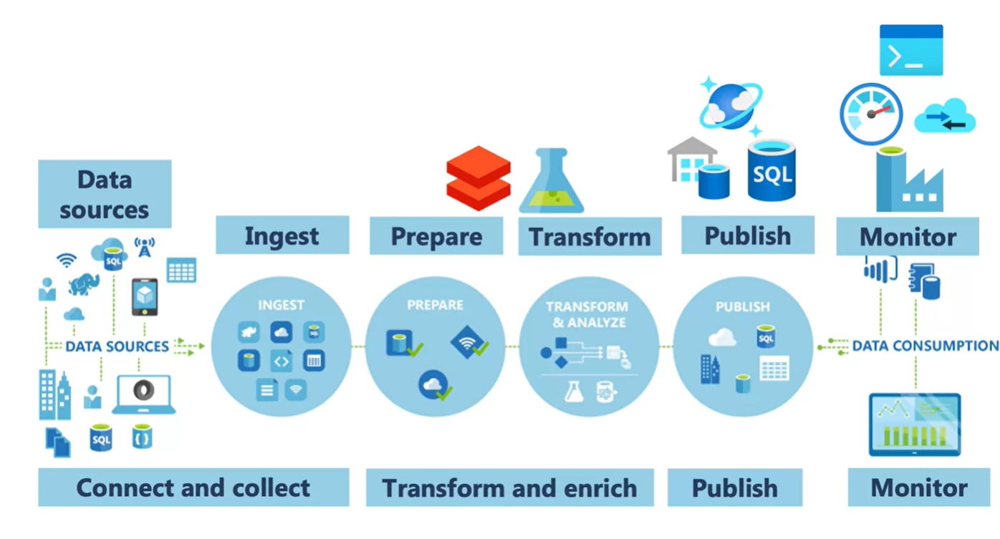
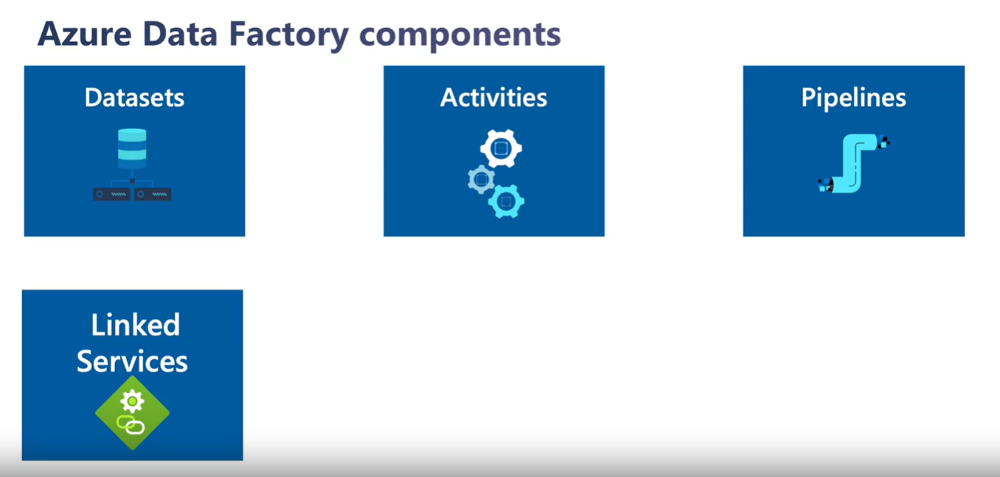
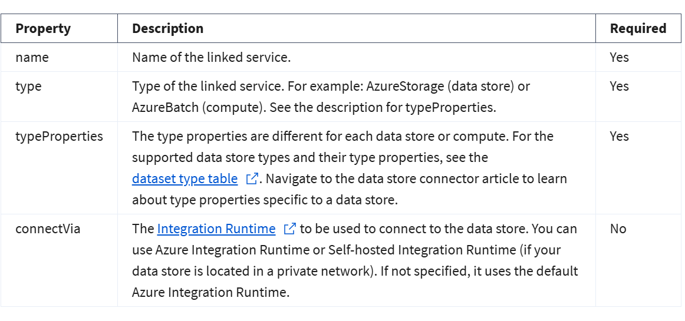
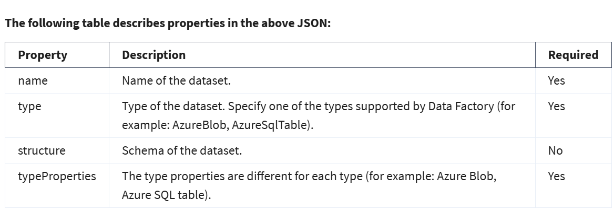
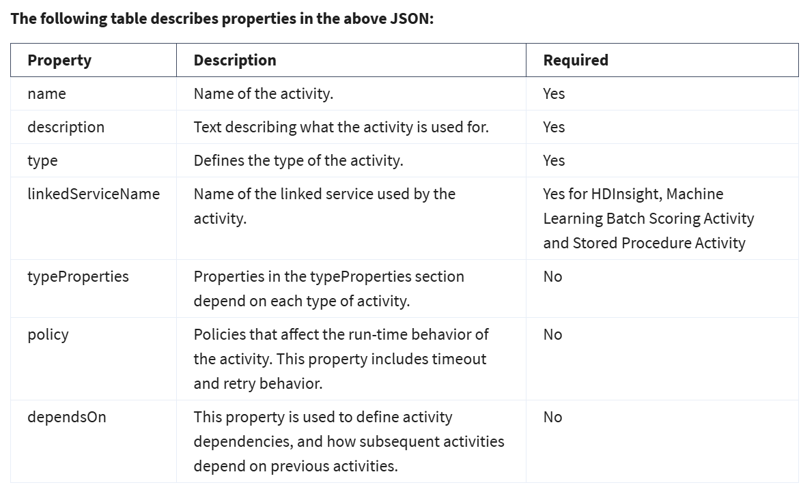
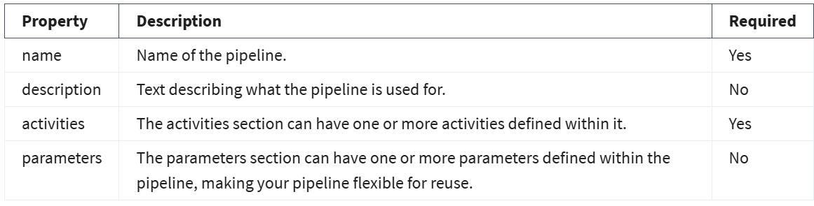

# 3. Azure Data Factory

`Azure Data Factory` provides a cloud-based data integration service that `orchestrates` the movement and transformation of data between various data stores and compute resources.



ADF Components:



To connect to external resources Data Factory uses a `Linked Service`.

## 3.1 Provision of Azure Data Factory with Terraform

[Download and install terraform](https://developer.hashicorp.com/terraform/install?product_intent=terraform) if it's not already installed.

Let's remember, how to use terraform commands.

```sh
terraform init  # Initialization of terraform
terraform plan  # See the changes before deployment

terraform apply # `<FILENAME>.auto.tfvars` applied by default
terraform apply -var-file=another-variable-file.tfvars  # Apply a different variable file
terraform apply -var="db_pass=$DB_PASS_ENV_VAR" # Passing Variables via CLI(don't forget the export the variable beforehand)

# To print out the specific output variables
terraform output output_name 

# To destroy all created resources
terraform destroy
```

Since we should not push the secrets in git, i put `.tfvars` in `.gitignore`. They consists of these variables below. You can assign your credentials to the variables.

```tfvars
# secrets.auto.tfvars
client_id       = ""
client_secret   = ""
tenant_id       = ""
subscription_id = ""
```

```tfvars
# terraform.auto.tfvars
adf_name            = ""
resource_group_name = ""
location            = ""
```

## 3.2. Create Linked Services


A linked service in Data Factory can be defined using the Copy Data Activity in the ADF designer, or you can create them independently to point to a data store or a compute resources. The Copy Activity copies data between the source and destination, and when you run this activity you are asked to define a linked service as part of the copy activity definition

Alternatively you can programmatically define a linked service in the JSON format to be used via REST APIs or the SDK, using the following notation:

```json
{
    "name": "<Name of the linked service>",
    "properties": {
        "type": "<Type of the linked service>",
        "typeProperties": {
              "<data store or compute-specific type properties>"
        },
        "connectVia": {
            "referenceName": "<name of Integration Runtime>",
            "type": "IntegrationRuntimeReference"
        }
    }
}
```

Description of the properties as below:




## 3.3. Create Datasets

A dataset is a named view of data that simply points or references the data you want to use in your activities as inputs and outputs. Datasets identify data within different data stores, such as tables, files, folders, and documents. For example, an Azure Blob dataset specifies the blob container and folder in Blob storage from which the activity should read the data.
A dataset in Data Factory can be defined as an object within the Copy Data Activity, as a separate object, or in a JSON format for programmatic creation as follows:

```json
{
    "name": "<name of dataset>",
    "properties": {
        "type": "<type of dataset: AzureBlob, AzureSql etc...>",
        "linkedServiceName": {
                "referenceName": "<name of linked service>",
                "type": "LinkedServiceReference",
        },
        "schema": [
            {
                "name": "<Name of the column>",
                "type": "<Name of the type>"
            }
        ],
        "typeProperties": {
            "<type specific property>": "<value>",
            "<type specific property 2>": "<value 2>",
        }
    }
}
```

Description of the properties as below:



## 3.4. Activities and Pipelines

Activities within Azure Data Factory define the actions that will be performed on the data and there are three categories including:

- Data movement activities
- Data transformation activities
- Control activities

### Data movement activities:
Data movement activities simply move data from one data store to another. You can use the Copy Activity to perform data movement activities, or by using JSON.

### Data transformation activities:
Data transformation activities can be performed natively within the authoring tool of Azure Data Factory using the Mapping Data Flow. Alternatively, you can call a compute resource to change or enhance data through transformation, or perform analysis of the data. These include compute technologies such as Azure Databricks, Azure Batch, SQL Database and Azure Synapse Analytics, Machine Learning Services, Azure Virtual machines and HDInsight.

### Control activities:
When graphically authoring ADF solutions, you can use the control flow within the design to orchestrate pipeline activities that include chaining activities in a sequence, branching, defining parameters at the pipeline level, and passing arguments while invoking the pipeline on-demand or from a trigger.

[Find](https://learn.microsoft.com/en-us/azure/data-factory/concepts-pipelines-activities?tabs=data-factory#data-movement-activities&wt.mc_id=datainteg_egcreatedatafacmvmnt_webpage_extlp) more details about these activities and pipelines.

When using `JSON notation`, the activities section can have one or more activities defined within it. There are two main types of activities: `Execution and Control Activities`. Execution (also known as Compute) activities include data movement and data transformation activities. They have the following top-level structure:

```json
{
    "name": "Execution Activity Name",
    "description": "description",
    "type": "<ActivityType>",
    "typeProperties":
    {
    },
    "linkedServiceName": "MyLinkedService",
    "policy":
    {
    },
    "dependsOn":
    {
    }
}
```

Description of the properties as below:



Here is a `pipeline`:

```json
{
    "name": "PipelineName",
    "properties":
    {
        "description": "pipeline description",
        "activities":
        [
        ],
        "parameters": {
         }
    }
}
```
Description of the properties as below:



## 3.5. Integration Runtimes(IR)

Integration runtime is the `compute infrastructure` used by ADF to provide various data integration capabilities across different network environments. There `three types` of IR's offered by ADF:

`1. Azure IR:` The compute resources are fully managed elastically in Azure.

`2. Self-Hosted IR:` It can run transform activities between a cloud data store and a (on-premise) data store in a `private network`. Limination is that `Data Flows` are not supported in self-hosted IR. Use instead Azure IR for that.

`3. Azure-SQL Server Integration Services(SSIS) IR:` It is fully managed cluster of Azure VMs or nodes dedicated to run your SSIS packages.

[Find](https://learn.microsoft.com/en-us/azure/data-factory/concepts-integration-runtime) more about Integration runtime in Azure Data Factory.
