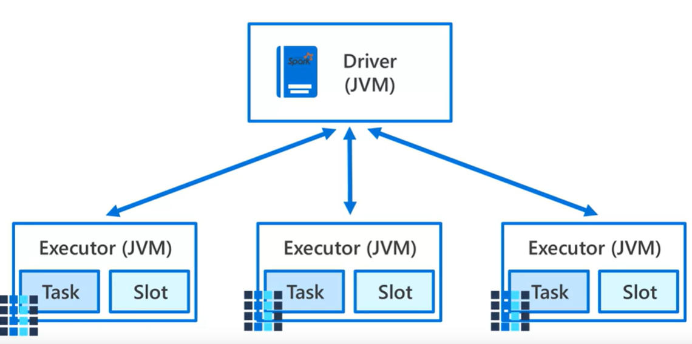

# 6. Azure Databricks

Azure Databricks is a cloud-based analytics platform on Azure, optimized for big data and machine learning. It runs on Apache Spark and allows data teams to collaborate in a unified workspace, supporting multiple languages like Python, SQL, and Scala. It integrates seamlessly with Azure services, providing scalability, security, and support for ETL, machine learning, and real-time analytics.

## 6.1. Spark Cluster Components

1. **Job**: A job is triggered when a Spark action (e.g., `count()`, `collect()`) is called. It represents a complete computation workflow.  
   *Example*: If you call `df.count()`, Spark creates a job to count the records in `df`.

2. **Stage**: A job is divided into stages based on shuffle boundaries. Each stage is a set of tasks that can be executed in parallel without needing to shuffle data.  
   *Example*: If the job involves filtering and then grouping data, it could be split into two stages (one for filtering, another for grouping and aggregating).

3. **Task**: Each stage is further divided into tasks, which are units of work executed on partitions of data. Each task processes a subset of data independently. A task is sent from the driver node to the worker nodes. 
   *Example*: If the dataset has 10 partitions, then 10 tasks are created to process each partition.

4. **Slot**: Work sent from the driver nodes to the worker nodes is assigned to slots, instructing them to pull data from a specified data source. A slot is a unit of computing resource (like CPU and memory) on a Spark executor, used to run tasks. Each executor has a limited number of slots based on its configuration.  
   *Example*: If an executor has 4 slots, it can run 4 tasks in parallel.

5. **Worker**: The Spark clusters, or datasets, are also known as workers.

6. **Driver**: An Apache Spark cluster, the driver is the notebook interface. It contains the main loop for the program and creates distributed datasets on the cluster.

### Small Example

Consider a job that reads data, filters it, and then aggregates by a key:

- **Job**: Entire workflow to read, filter, and aggregate.
- **Stage 1**: Filter stage, parallelized over the data partitions.
- **Stage 2**: Aggregate stage, requires shuffling and is also parallelized.
- **Tasks**: Each stage has multiple tasks, one for each data partition.
- **Slots**: If there are 4 slots per executor, up to 4 tasks can run simultaneously on each executor.

To put it all together:

- In Spark, **work** submitted to the cluster is split into **Jobs**. **Jobs** are divided into **stages**, and **stages** are divided into **tasks**.
- The **driver** coordinates the entire process by distributing the work to **executors** (also called workers).
- Each **executor** runs tasks in parallel using available **slots** (CPU and memory resources).

In short: *The driver sends the workload to executors, and tasks are executed in parallel within slots on each executor.* 

The architecture of a spark job looks like:

Since databricks provides robust high performing cluster management solution, we don't need to concern with the cluster management. From a developer perspective, our primiraly focus should be on the following issues:

1. Number of partitions your data divided into
2. Number of available slots for parallel execution
3. Number of jobs triggered
4. Number of stages the jobs divided into

## 6.2. Magic Commands

* Magic Commands are specific to the Databricks notebooks
* A single percent (%) symbol at the start of a cell identifies a Magic Commands

* **&percnt;python** -> Runs the cell with python
* **&percnt;scala** -> Runs the cell with scala
* **&percnt;sql** -> Runs the cell with sql
* **&percnt;r** -> Runs the cell with R
* **&percnt;sh** -> Runs the cell as a linux shell
* **&percnt;run** -> You can run a notebook from another notebook. All variables & functions defined in that other notebook will become available in your current notebook.
* **&percnt;fs** -> Runs the cell as Databricks File System(DBFS).

# 6.3. Databricks Utilities - dbutils

* You can access the DBFS through the Databricks Utilities class (and other file IO routines).
* An instance of DBUtils is already declared for us as `dbutils`.
* For in-notebook documentation on DBUtils you can execute the command `dbutils.help()`.
